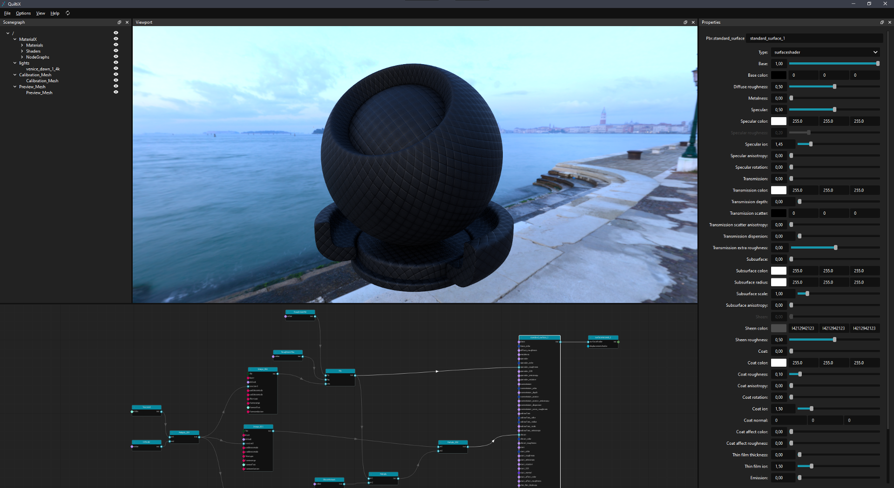

<p align="center">
  
</p>

----  

<div align="center">

[](https://github.com/PrismPipeline/QuiltiX/LICENSE)
[](https://github.com/PrismPipeline/QuiltiX/releases/latest)
</div>

QuiltiX is a graphical node editor to edit, and author [MaterialX](https://materialx.org/) based materials of 3D assets. It includes a viewport based on [OpenUSD](https://www.openusd.org/release/index.html)'s [Hydra](https://openusd.org/release/glossary.html#hydra), which enables viewing your assets in any renderer supporting both Hydra & MaterialX.

 

## Table of Contents  <!-- omit from toc -->

- [Requirements](#requirements)
- [Installation](#installation)
- [Running QuiltiX](#running-quiltix)
- [Integrating with your environment](#integrating-with-your-environment)
  - [Adding Hydra delegates](#adding-hydra-delegates)
    - [Changing the default Hydra delegate](#changing-the-default-hydra-delegate)
  - [Adding custom MaterialX Node definitions](#adding-custom-materialx-node-definitions)
- [Contributing](#contributing)
- [License](#license)

## Requirements
Quiltix requires Python 3.9+ as well as compiled versions of USD and MaterialX.

## Installation
1) Clone the repository

```
git clone https://github.com/PrismPipeline/QuiltiX.git
cd QuiltiX
```

2) Install the dependencies

Here you have couple of options.

This will install the base python dependencies, excluding any development dependencies and MaterialX + USD

```
pip install -e . 
```

If you want to just install everything (Python dependencies, dev dependencies, MaterialX & USD)
```
pip install -e .[all]
```

<details>
  <summary>Additional install options</summary>

These are the additional install options available
```
pip install -e .[usd,materialx,dev]
```
For more information see [pyproject.toml](pyproject.toml)
</details>


## Running QuiltiX

python -m QuiltiX 

## Integrating with your environment
QuiltiX tries to rely as much as possible on pre-existing environment variables from MaterialX/USD to extend its systems.

Overview over the most important Environment Variables:
| Environment Variable | Purpose | Variable Type | Example |
|-|-|-|-|
| PXR_PLUGINPATH_NAME | Paths to Hydra delegate plugins | Paths | |
| PXR_MTLX_STDLIB_SEARCH_PATHS | Paths to custom MaterialX node definition locations | Paths | |
| HD_DEFAULT_RENDERER | Name of the default Hydra delegate for the viewport | String | GL |

Additional information and instructions can be found below.

### Adding [Hydra delegates](https://openusd.org/release/glossary.html#hydra)
> **_NOTE_**  
> The Hydra renderer needs to support MaterialX for it to work in QuiltiX.  


**_What is a Hdyra Delegate?_**  
"Hydra Render Delegates are bridges between the Hydra viewport and a renderer. They were created by Pixar as part of the Hydra renderer used in usdview. The Hydra Render Delegate system allows the ability to switch out the backend renderer for the viewport data in Hydra. [...]"<sup>[[src]](https://learn.foundry.com/katana/dev-guide/Plugins/HydraRenderDelegates/Introduction.html#what-is-a-hydra-render-delegate)</sup>

The [Storm Hydra Delegate](https://openusd.org/dev/api/hd_storm_page_front.html) by Pixar is both shipped with USD and enabled per default in QuiltiX. 

> ❗Adding additional Hydra delegates can, depending on the renderer, be a non-trivial task due to the need of matching USD (and potentially MaterialX) versions for the compiled binaries. Some renderers also need additional configuration for additional features like renderer specific procedurals or shaders.

To register a Hydra renderer plugin the Hydra plugin directory of the renderer needs to be added to the `PXR_PLUGINPATH_NAME` environment variable. Generally renderers also need their binaries added to the `PATH` enviornment variable, but there might be additional variables for licensing or additional features.  

Below is a non-exhaustive list of install instructions for Hydra renderers. The USD Working group also has a good collection of available hydra delegates available [here](https://wiki.aswf.io/display/WGUSD/USD+Projects+and+Resources#USDProjectsandResources-Hydra)
* [Arnold](https://github.com/Autodesk/arnold-usd#building-and-installation)

#### Changing the default Hydra delegate
The default Hydra delegate can be changed by setting the `HD_DEFAULT_RENDERER` environment variable to the preferred renderer.

```shell
HD_DEFAULT_RENDERER="GL"
``````


### Adding custom MaterialX Node definitions

To add custom MaterialX node defintions they can be added by adding the location of the node definition files to the `PXR_MTLX_STLIB_SEARCH_PATHS` environment variable.


## Contributing

We welcome contributions to the QuiltiX! If you'd like to contribute, please follow these steps:

1. Fork the repository.
2. Create a feature branch.
3. Commit your changes.
4. Submit a pull request.

## License

QuiltiX is licensed under the Apache License. See [LICENSE](LICENSE) for more information.
